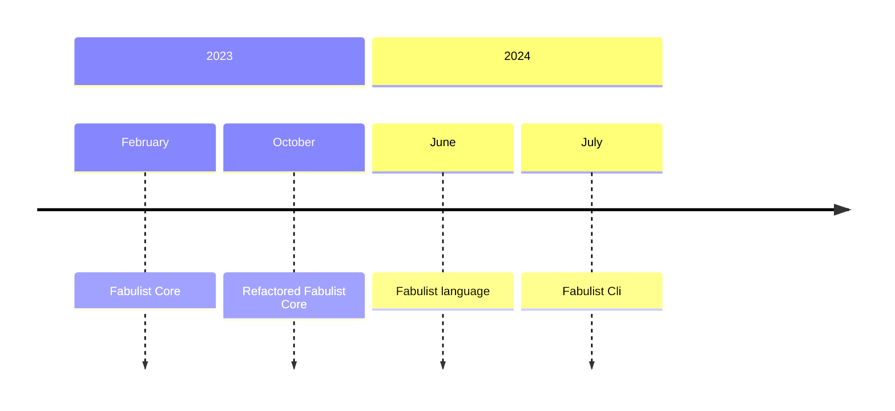
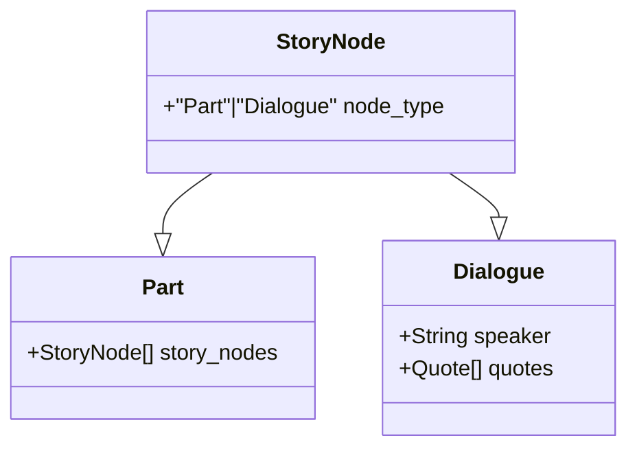
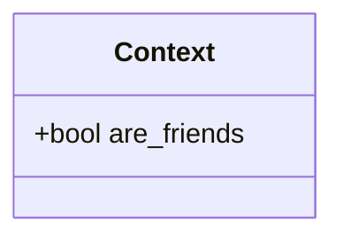
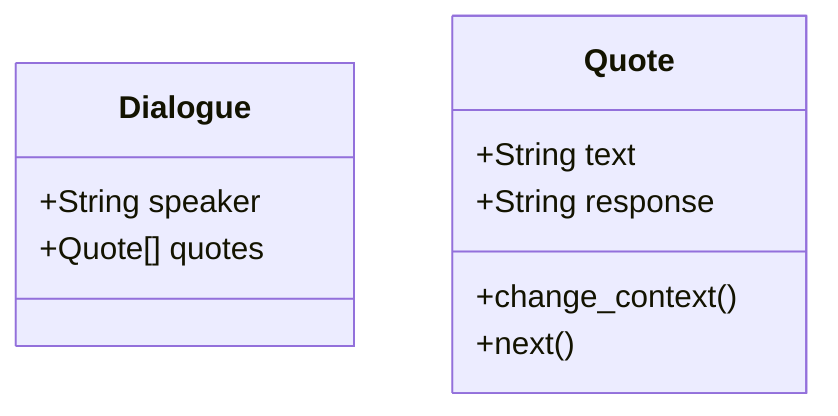
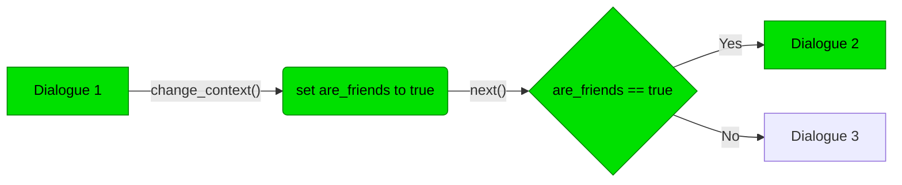

# Fabulist

    

    A branching narrative utility for interactive novels.

    

## About

Fabulist is a builder that uses a context-based model to create a branching narrative. A plethora of the currently existing API interfaces used for designing interactive novels *(e.g. Visual Novels or Text-based adventures)* are plagued with complexity and a steep learning curve. I believe that it's due to this inaccessibility that drives the unique art medium to obscurity. This library aims to manifest the potential of branching narratives by introducing a new standard and making their creation approachable to the masses.

## Contents

1. [`fabulist_core`](./packages/fabulist_core/) - The structural crate of the project. It contains the base specification of the library as well as the data structures that concerns it.
2. [`fabulist_lang`](./packages/fabulist_lang/) - Crate that contains the grammar definition, parser, and interpreter of the fabulist domain-specific language (DSL).

## Roadmap

The core will serve as the foundation of an ecosystem of applications planned to bring fabulist to everyone. As such, it is tantamount that it's entirely flexible and has all the utilities needed to create a narrative. Future iterations of this library aims to have transpilation to widely used languages (JavaScript, Java, and Python) as well as a markup language preprocessor for industry-use.

## Design

### Structure

The fabulist story model revolves around a loose tree structure. Each node of the tree can either be a `dialogue` or a `part`.

1. **Dialogue** - the dialogue type is where most of the important information is stored. Things such as the speaker's name, what they said are all found inside the dialogue structure.

    > **Quotes** are the responses of the speakers. If the dialogue node only has one quote, then that suggests a linear progression. This means that the speaker simply said such quote. Multiple quotes, on the other hand, suggests that a decision of what the speaker should say is necessary. This is where branches are made from the narrative.

2. **Part** - the part type is simply a container that groups other story nodes together. This introduces the concept of story partitions such as Scenes, Parts, Acts, or Chapters.

An entire fabulist story is simply a collection of these two node types. As you can see, the structure is easily digestible or comprehensive.

### Linkages

Instead of one-to-one correspondence between a response (common to traditional implementations), fabulist uses something called the **Context**.

The story context is a metadata attached to the story that is globally accessible to all the nodes. It is what dictates the flow of the narrative and is why I refer to the story structure as *loose*.

It's easier to explain its use from an example. Let's say we have a value named `are_friends` within our story's context.

We can mutate that value with the quote's `change_context()` callback. This takes in the `Context` as an argument and changes its values given the user's intention. The `next()` callback, on the other hand, queries these values and return the id of the next node. If you're familiar with ternary expressions, you can imagine its content to be something akin to `if context.value == true ? dialogue_1 : dialogue_2`. These callbacks are called after each dialogue to determine the proceeding node.

With that, an example flow of the narrative will go as follows.

This type of linking introduces a more idiomatic way of creating a branching narrative. Instead of linking nodes to a response, we instead base it on quantified states generated throughout the story.

The applications for this is limitless! Using dating visual novels as an example, affection points of potential lovers could be stored inside the context as incrementing values. This would eliminate a lot of the tedium from designing response trees, and allow creators to focus on just writing dialogues. That, in my opinion, is more organic.
