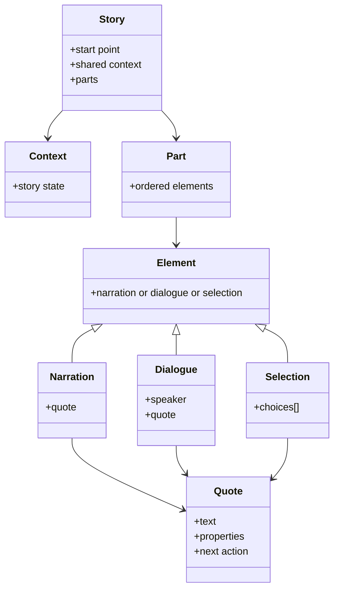
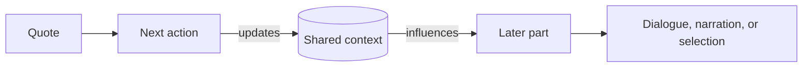
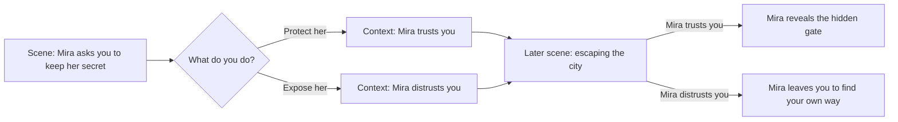

# Fabulist

<p align="center">
    
</p>
<p align="center">
    A branching narrative language and compiler toolchain for interactive fiction.
</p>
<p align="center">
    
</p>

## About

Fabulist is built for stories that should feel authored through consequences, not just routed through branches. Its central idea is simple: the story remembers what has happened, and later scenes can react to that memory.

That makes Fabulist idiomatic for writers who think in scenes, relationships, tension, and payoff. Instead of manually wiring every response into an isolated branch, you can let choices reshape a shared story context and let future scenes respond to that evolving state. Trust can rise or fall. Affection can accumulate. A promise made early can matter much later.

The result is a style of interactive fiction that fits long-form consequences, relationship-driven writing, and stories where the world should feel like it is reacting to the reader rather than just redirecting them.

In practice, the Fabulist rhythm is:

1. Write the story in parts, dialogue, narration, and selections.
2. Let choices change the shared context of the story.
3. Let later scenes read that context and answer it.

The current interface is compiler-first. The main entry point is the `fabulate` CLI, backed by the `fabc` compiler, with simple commands to build a standalone executable, compile reusable artifacts, or play a compiled bundle.

## Quick Start

If you want something concrete to try right away, start with [`examples/first-story.fab`](./examples/first-story.fab).

```bash
cargo run -p fabulate -- build examples/first-story.fab -o first-story
cargo run -p fabulate -- compile examples/first-story.fab --bundle dist/first-story
cargo run -p fabulate -- play dist/first-story
```

`build` produces a runnable executable, `compile` prepares build artifacts and bundles, and `play` runs a compiled story bundle.

## Design

### Structure

Fabulist stories revolve around a loose tree structure. A story is organized into parts, and each part is made of the story elements that the reader actually experiences: narration, dialogue, and selections.


```mermaid
classDiagram
    Story --> Context
    Story --> Part
    Part --> Element
    Element <|-- Narration
    Element <|-- Dialogue
    Element <|-- Selection
    Narration --> Quote
    Dialogue --> Quote
    Selection --> Quote

    class Story {
        +start point
        +shared context
        +parts
    }
    class Context {
        +story state
    }
    class Part {
        +ordered elements
    }
    class Element {
        +narration or dialogue or selection
    }
    class Narration {
        +quote
    }
    class Dialogue {
        +speaker
        +quote
    }
    class Selection {
        +choices[]
    }
    class Quote {
        +text
        +properties
        +next action
    }
```

Parts give the story its larger shape: scenes, chapters, encounters, or whatever division best fits the narrative. Narration and dialogue carry the moment-to-moment writing. Selections are where the reader is invited to act.

At the center of all three is the quote. Quotes are the basic expressive unit of the language: the text the reader sees, along with any story properties or follow-up behavior attached to it.

This keeps the model close to how stories are usually written. You are not thinking in terms of a giant routing table first. You are thinking in terms of scenes, lines, and the moments where the reader can intervene.

### Linkages

Instead of tying every response to a fixed one-to-one destination, Fabulist uses a shared story context. That context is global to the story and carries the state that the narrative can react to over time.

That state might represent trust, suspicion, affection, promises, inventory, knowledge, or any other fact the story should remember.

A simpler way to picture it is that a quote can trigger a next action, that action can update the shared context, and later parts can respond to the new state.


```mermaid
flowchart LR
    quote[Quote]
    action[Next action]
    context[(Shared context)]
    part[Later part]
    step[Dialogue, narration, or selection]

    quote --> action
    action -->|updates| context
    context -->|influences| part
    part --> step
```

This means a choice does not only decide what happens next. It can also change what the story means later. A small decision can linger, accumulate, and quietly reshape scenes that come much further down the line.

That is why the design feels more idiomatic for consequence-driven writing: the branch is not only the jump, it is the state the jump leaves behind.

### Example Flow

An example flow of the narrative might look like this:


```mermaid
flowchart LR
    scene_1[Scene: Mira asks you to keep her secret] --> choice{What do you do?}
    choice -->|Protect her| trust_up[Context: Mira trusts you]
    choice -->|Expose her| trust_down[Context: Mira distrusts you]
    trust_up --> later[Later scene: escaping the city]
    trust_down --> later
    later -->|Mira trusts you| scene_2[Mira reveals the hidden gate]
    later -->|Mira distrusts you| scene_3[Mira leaves you to find your own way]
```

This is the heart of Fabulist's design. The story is not branching only because the reader clicked a different line. It is branching because the story itself is now in a different state, and that state changes how later scenes answer the reader.

That lets authors spend less time micromanaging explicit route maps and more time shaping a world whose consequences feel cumulative and organic.

## License

Fabulist is primarily distributed under the terms of both the MIT license and the Apache License (Version 2.0).

See LICENSE-APACHE, LICENSE-MIT, and COPYRIGHT for details.
